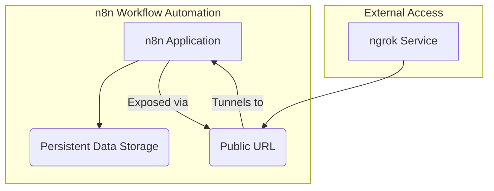

# N8N Workflow Automation Setup

This project contains a Docker Compose configuration for running [n8n](https://n8n.io/) workflow automation platform with ngrok for external access.



## Components

- **n8n**: A workflow automation tool that allows you to connect different services and automate tasks
- **ngrok**: A service that creates secure tunnels to expose the n8n instance to the internet

## Prerequisites

- Docker and Docker Compose installed on your system
- ngrok authtoken (already configured in the compose file)
- External volume `n8n_data` created for persistent storage

## Configuration

The setup includes:

- n8n running on port 5678
- ngrok management interface accessible on port 4040
- Timezone set to Asia/Ho_Chi_Minh
- Debug level logging enabled
- Runners feature enabled
- Persistent data storage using Docker volumes

## Getting Started

1. Create the required external volume:
```bash
docker volume create n8n_data
```

2. Start the services:
```bash
docker compose up -d
```

3. Access n8n:
   - Local: http://localhost:5678
   - External: Check the ngrok URL via http://localhost:4040

## Environment Variables

### n8n Service
- `GENERIC_TIMEZONE`: Set to Asia/Ho_Chi_Minh
- `N8N_RUNNERS_ENABLED`: Enabled
- `N8N_LOG_LEVEL`: Set to debug
- `N8N_LOG_OUTPUT`: Set to console
- `WEBHOOK_URL`: Configured with ngrok URL

### ngrok Service
- `NGROK_AUTHTOKEN`: Authentication token for ngrok service

## Persistence

The n8n data is persisted using a Docker volume named `n8n_data`. This ensures your workflows and settings are preserved between container restarts.

## Maintenance

To update the services:

1. Pull the latest images:
```bash
docker compose pull
```

2. Restart the services:
```bash
docker compose down
docker compose up -d
```

## Additional Resources

- [n8n Documentation](https://docs.n8n.io/)
- [ngrok Documentation](https://ngrok.com/docs)